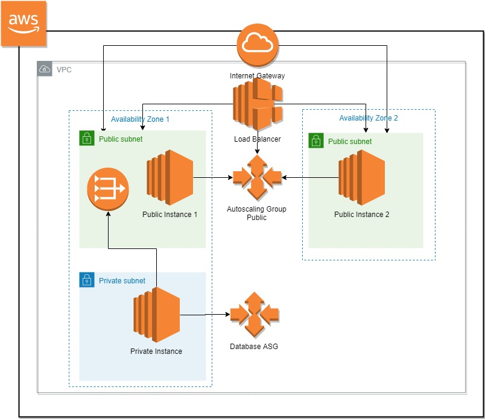

# terraform-EC2-RDS

# CLOUDFORMATION-MySQLWebApp

## Description:
	 
	This is a Terraform template for configuring MySQL in an instance and access it through a server
	placed in a Public Subnet. The MySQL Database is kept private and is accessed through the public
	instances. Load balancers and Autoscaling groups are configured accordingly.
	

## INFRASTRUCTURE DIAGRAM: 



## About the Project

    This is an RDS implementation of complete AWS infrastructure of 2 tier database in which there are two 
    application in which there are two public and two private instances. 
## Prerequisites

    In order to use this project completely, knowledge of some tools and skills are required along with 
    some useful resources. Those are stated below.
    
    - AWS account 
    - AWS services basic knowledge
    - [Terraform](https://www.terraform.io/) knowledge
    - [Cloudformation](https://aws.amazon.com/cloudformation/) knowledge.
    is required


## Parameterization 

    The code is fully parameterized and all your settings are to be parsed through variable file.

## VPC-structure

	This repository contains 3 modules. Each module is dependent on the other so they will be uploaded in
	the given order.
		1. vpc
		2. database
		3. ec2

### 1. vpc
	In this file, a VPC is defined containing 4 subnets. Two of them are public and two is private.
	An internet gateway is attached to the public subnets and NAT gateway is attached to the private
	subnet. Routes were configured accordingly. The resources in the private subnet can only be 
	accessed through the public subnet. The network access control list is also defined which 
	whitelists all the IPs and can be edited to control access through any IP. Parameterization has 
	been done accordingly and are to be set according to the needs of the infrastructure.

### 2. database

	This module contains a database which uses MySQL. It is placed in private subnet group. It can 
    only be accessed through the public subnet. 

### 3. ec2

	The load balancer is configured in this file. It is an application balancer. It re-routes the 
	port 80 traffic of the Public instances. It is configured to operate in the public 	subnet. 
    Health checks are also set inside the load balancer. Parameterization has been 
	done accordingly and are to be set according to the needs of the infrastructure. The instances are 
    formed using launch configuration and deployed via auto-scaling-group.

## Running the module

    By going to the repository folder and running the following commands, this will be depolyed on the
    cloud.
    ```
    terraform init
    terraform plan -var-file="The path and name of the variables file"
    terraform apply -var-file="The path and name of the variables file"
    ```
## State Management

    State Management has numerous advantages like
    - Safer storage: Storing state on the remote server helps prevent sensitive information. State file
      remains same but remote storage like S3 provides a layer to security like making S3 bucket private and 
      giving limited access.
    - Auditing: Invalid access can be identified by enabling logging.
    - Share data: Remote storage helps share state file with other members of team.

    The backend lock is placed inside the backend.tf file. It is better to make the bucket and DynamoDB table manuallly to 
    avoid any mishaps.
